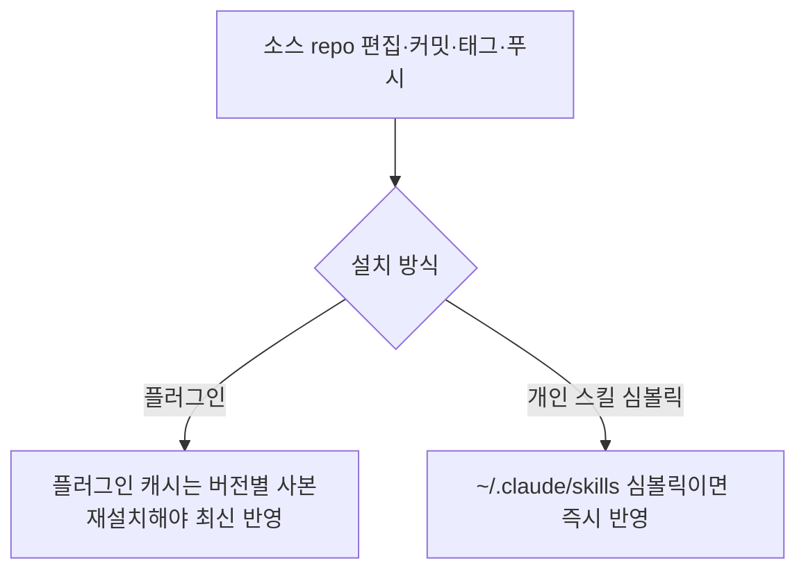

# RUNBOOK — Quetzalcoatl 운영

> 상태: 활성 · 날짜: 2026-06-23 · 소유자: Orchestrator · 승인: CHENGHAO QUAN

## 배포 (현재: v2.0.0)

소스 진실 원천: `/home/chquan/Quetzalcoatl` (이 repo). 배포 경로 2가지.



1. **커밋·태그·푸시**: 본 사이클에서 수행(아래 명령은 RETRO/CHANGELOG 참조).
2. **플러그인 사용자**: 캐시 `…/quetzalcoatl/<버전>/`은 버전별 **사본**이다(심볼릭 아님). 최신(현재 2.0.0)을 받으려면 재설치/업데이트:
   ```text
   /plugin marketplace update quetzalcoatl   # 또는 marketplace add 재실행
   /plugin install quetzalcoatl@quetzalcoatl
   ```
   새 세션에서 `/quetzalcoatl:Quetzalcoatl` 호출 시 최신(현재 2.0.0) 적용.
3. **개인 스킬(심볼릭) 사용자**: `~/.claude/skills/Quetzalcoatl`가 이 repo로 심볼릭이면 즉시 반영. 사본이면 복사 갱신.
4. **Codex 개인 스킬 사용자**: `~/.codex/skills/Quetzalcoatl`도 repo `skills/Quetzalcoatl/`를 복사 갱신(`cp`)한다 — Claude 플러그인과 **별개 설치 경로**라 둘 다 동기해야 한다(예: 2026-06-29 1.4.2→1.6.0 동기).

## 검증

- `grep '^version:' skills/Quetzalcoatl/SKILL.md` → `2.0.0`.
- 새 세션에서 `/Quetzalcoatl` → §18~§22 동작 확인.

## 롤백

| 상황              | 방법                                                        |
| ----------------- | ----------------------------------------------------------- |
| 푸시 전           | `git reset --hard <이전커밋>` (로컬만)                      |
| 푸시 후, 되돌리기 | `git revert <범위>` 후 push (히스토리 보존, 안전)           |
| 특정 버전 재설치  | `git checkout v1.1.0 -- skills/` 또는 플러그인 1.1.0 재설치 |

> `git push --force`/히스토리 재작성은 §1.6 게이트 — 사람 승인 필요.

## 모니터링 지표

- 사용자 보고: 자율 실행이 게이트에서 멈추는가(R1).
- 핸드오프 시 충돌 빈도(R2).
- ChatGPT 경로에서 기능 강등이 동작하는가(R3).
