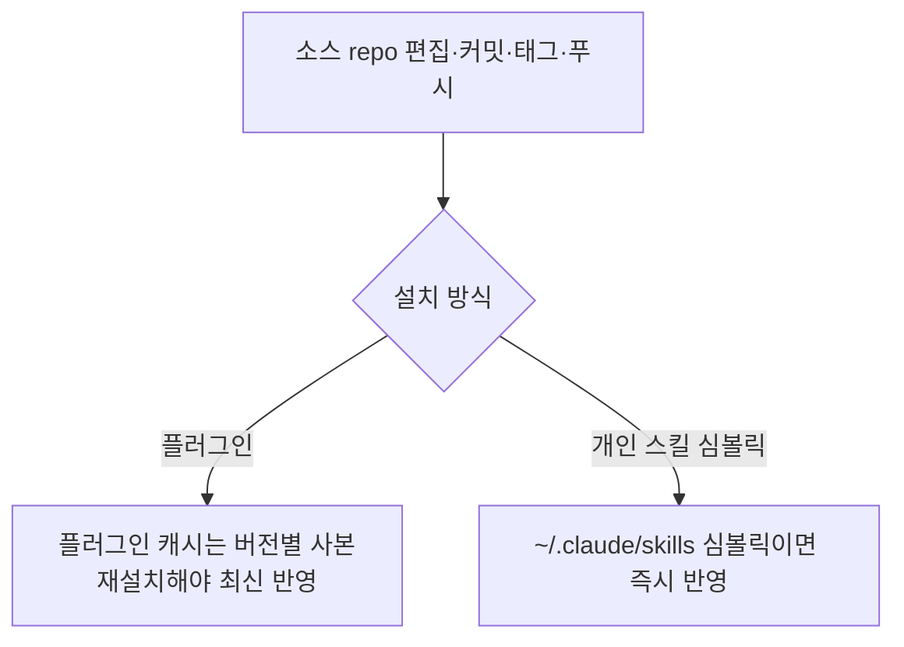

# RUNBOOK — Quetzalcoatl 운영

> 상태: 활성 · 날짜: 2026-06-23 · 소유자: Orchestrator · 승인: CHENGHAO QUAN

## 배포 (현재: v3.0.0)

소스 진실 원천: `/home/chquan/Quetzalcoatl` (이 repo). 배포 경로 2가지.


```mermaid
flowchart TD
  S[소스 repo 편집·커밋·태그·푸시] --> A{설치 방식}
  A -- 플러그인 --> P[플러그인 캐시는 버전별 사본<br/>재설치해야 최신 반영]
  A -- 개인 스킬 심볼릭 --> L[~/.claude/skills 심볼릭이면 즉시 반영]
```

1. **커밋·태그·푸시**: 본 사이클에서 수행(아래 명령은 RETRO/CHANGELOG 참조).
2. **플러그인 사용자**: 캐시 `…/quetzalcoatl/<버전>/`은 버전별 **사본**이다(심볼릭 아님). 최신(현재 3.0.0)을 받으려면 재설치/업데이트:
   ```text
   /plugin marketplace update quetzalcoatl   # 또는 marketplace add 재실행
   /plugin install quetzalcoatl@quetzalcoatl
   ```
   새 세션에서 `/quetzalcoatl:Quetzalcoatl` 호출 시 최신(현재 3.0.0) 적용.
   ⚠️ **마켓플레이스 클론이 stale이면 재설치가 구버전을 다시 깐다**(2026-07-03 실제 재발 — v3.0.0 재설치 시도가 2.0.1을 재설치). 증상: 캐시에 새 버전 디렉터리가 안 생김. 조치: `git -C ~/.claude/plugins/marketplaces/quetzalcoatl merge --ff-only origin/main`으로 클론을 먼저 최신화한 뒤 `claude plugin update quetzalcoatl@quetzalcoatl`(또는 in-app `/plugin`) 재실행.
3. **개인 스킬(심볼릭) 사용자**: `~/.claude/skills/Quetzalcoatl`가 이 repo로 심볼릭이면 즉시 반영. 사본이면 복사 갱신.
4. **Codex 개인 스킬 사용자**: `~/.codex/skills/Quetzalcoatl`도 repo `skills/Quetzalcoatl/`를 복사 갱신(`cp`)한다 — Claude 플러그인과 **별개 설치 경로**라 둘 다 동기해야 한다(예: 2026-06-29 1.4.2→1.6.0 동기). v3.0.0부터 `SKILL.md`+`TEMPLATES.md` **두 파일**이 한 세트다(폴더째 복사).
5. **챗 환경(ChatGPT 등) 사용자**: 페이스트 번들 `dist/Quetzalcoatl-FULL.md`를 붙여넣는다. 번들은 `scripts/build-paste-bundle.sh`로 생성하며 CI가 신선도를 검사한다.

## 검증

- `grep '^version:' skills/Quetzalcoatl/SKILL.md` → `3.0.0`.
- `bash scripts/build-paste-bundle.sh /tmp/b.md && diff /tmp/b.md dist/Quetzalcoatl-FULL.md` → 차이 없음.
- 재설치 후 플러그인 캐시(또는 개인 스킬 폴더)에 `SKILL.md`와 **`TEMPLATES.md`가 함께** 있는지 확인 — 한 세트(v3.0.0 분리 구조).
- 새 세션에서 `/Quetzalcoatl` → §18~§22 동작 + 템플릿 필요 모드에서 `TEMPLATES.md` 로드 확인.

## 롤백

| 상황              | 방법                                                        |
| ----------------- | ----------------------------------------------------------- |
| 푸시 전           | `git reset --hard <이전커밋>` (로컬만)                      |
| 푸시 후, 되돌리기 | `git revert <범위>` 후 push (히스토리 보존, 안전)           |
| 특정 버전 재설치  | `git checkout v1.1.0 -- skills/` 또는 플러그인 1.1.0 재설치 |

> `git push --force`/히스토리 재작성은 §1.6 게이트 — 사람 승인 필요.

## 모니터링 지표

- 사용자 보고: 자율 실행이 게이트에서 멈추는가(R1).
- 핸드오프 시 충돌 빈도(R2).
- ChatGPT 경로에서 기능 강등이 동작하는가(R3).
