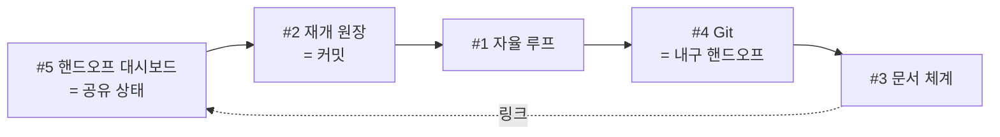

# Quetzalcoatl 프로젝트 문서

> 상태: 활성 · 날짜: 2026-06-23 · 소유자: Quetzalcoatl OS(Claude Opus 4.8) · 승인: CHENGHAO QUAN

이 디렉터리는 **Quetzalcoatl 스킬 자신의 개발**을 Quetzalcoatl 문서 체계(SKILL.md §6)로 관리한 것이다(dogfooding).
현재 사이클: **v1.3.0 — 앵커된 선호 처리(§4.2) · 대안 비교 §4 승격(번호 정정) · 저장소 전문화.**
직전 사이클: **v1.2.0** — 5개 능력 추가.

## 이번 사이클(v1.3.0)의 한 줄

사용자 **선호를 존중하되 근거가 이기면 투명하게 뒤집는** 규칙(§4.2)을 더하고, 대안 비교를 §4로 승격해 섹션 번호를 정합화하며(§3 다음이 §5였던 누락 정정), 저장소를 전문가용으로 정비(배지·CI·SECURITY·topics).

> 직전 **v1.2.0**: 단일 세션 자문 OS → 지속·재개 가능한 다중 에이전트/다중 기기 실행 OS(아래 다이어그램).

## 문서 지도

| 단계 | 문서                                                         | 내용                     |
| ---- | ------------------------------------------------------------ | ------------------------ |
| 개요 | [PROJECT_BRIEF](00-overview/PROJECT_BRIEF.md)                | 문제·목표·성공/실패 기준 |
| 개요 | [DASHBOARD](00-overview/DASHBOARD.md)                        | 진행·작업 보드·재개 지점 |
| 발견 | [OFFICE_HOURS](01-discovery/OFFICE_HOURS.md)                 | 의미 압박 검토           |
| 발견 | [FEASIBILITY_REPORT](01-discovery/FEASIBILITY_REPORT.md)     | 타당성 점수화            |
| 발견 | [ASSUMPTIONS](01-discovery/ASSUMPTIONS.md)                   | 가정과 검증 상태         |
| 결정 | [DECISION_LOG](02-decisions/DECISION_LOG.md)                 | 주요 결정                |
| 결정 | [ALTERNATIVES](02-decisions/ALTERNATIVES.md)                 | 대안 비교                |
| 결정 | [CROSS_VALIDATION_LOG](02-decisions/CROSS_VALIDATION_LOG.md) | 교차검증/적대 검토       |
| 명세 | [SPEC](03-spec/SPEC.md)                                      | 요구사항·수용 기준       |
| 품질 | [RISK_REGISTER](04-quality/RISK_REGISTER.md)                 | 리스크                   |
| 품질 | [TEST_PLAN](04-quality/TEST_PLAN.md)                         | 테스트·결과              |
| 운영 | [RUNBOOK](05-ops/RUNBOOK.md)                                 | 배포·롤백                |
| 운영 | [RETRO](05-ops/RETRO.md)                                     | 회고                     |
| 부록 | [GLOSSARY](appendix/GLOSSARY.md)                             | 용어                     |
| 부록 | [CONVENTIONS](appendix/CONVENTIONS.md)                       | 문서·Git 규칙            |

규칙은 [appendix/CONVENTIONS.md](appendix/CONVENTIONS.md)를 단일 기준으로 따른다(혼용 금지).
